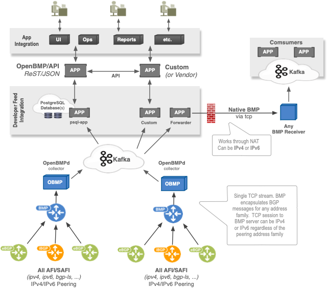

# OpenBMP

OpenBMP is a BGP monitoring System.  This can be used with any compliant BMP sender (e.g., router). BGP
data is primarly stored in PostgreSQL. RIBs are state maintained as well as full history for every
changed BGP update. 

OpenBMP Flow
------------

* BMP devices (e.g. routers) send BMP messages to a OpenBMP collector/daemon.   One OpenBMP daemon can handle many
  routers and bgp peers, but in a large network with transit links and full internet routing tables, multiple OpenBMP
  collectors are recommended.   Simply configure on the BMP device (router) which BMP server that should be used.

* Kafka enables many applications the ability to tap into the existing BMP feeds from any number of routers.
  A single BMP feed via OpenBMP can feed data into hundreds of consumer apps, such as MySQL, Cassandra,
  Real-time monitors, Flat file, ELK, Apache Spark, etc.

* Admins, Network Engineers, automated programs/scripts, etc. interact with the OpenBMP API or
  any other consuming application

Supported Features Highlights
-----------------------------
Below is a list of some key features supported today in OpenBMP.  Many more features exist.

Feature | Description
-------: | -----------
RPKI/IRR | RPKI and IRR integration enables security analysis of monitored prefixes and ASN's.
Topic Mapping | Dynamic and customizable topic names. Scale Kafka consumers by partition and topic
draft-ietf-grow-bmp | BMP Version 3 with backwards compatibility with older drafts
Apache Kafka | Producer of parsed and RAW BMP feeds, multiple consumers available
Database | Access to all collected data via standard ODBC/DB drivers (openbmp-mysql-consumer)
File Logging | All parsed messages can be logged to files, including BMP binary streams (openbmp-file-consumer)
IPv4 | IPv4 Unicast routing table information
IPv6 | IPv6 Unicast routing table information
bgp-ls| [RFC7752](https://tools.ietf.org/html/rfc7752)
Extended Communities | Roughly all of them
VPNv4 | L3VPN routing information (within VRF)

So much more...

Use-Cases
---------
There are many reasons to use OpenBMP, but to highlight a few common ones:

* **Centralized BMP Collector** - OpenBMP is a producer to Kafka.  You can write your own consumer
  or use an existing one.  Other products can interact with OpenBMP via Apache Kafka for RAW
  BMP streams or the parsed messages.   See [Message Bus API Specification](api/kafka_message_schema.md) for more details.

* **Real-Time Topology Monitoring** - Can monitor and alert on topology change, policy changes or lack of enforcement, route-leaking, hijacking, etc.

* **BGP/Route Security** - Route leaking, hijacking by origination, by better transit paths, or deviation from baseline

* **Looking Glasses**  - IPv4, IPv6, and VPN4

* **Route Analytics** - Track convergence times, history of prefixes as they change over time, monitor and track BGP policy changes, etc...

* **Traffic Engineering Analytics**  - Adapt dynamically to change and know what is the best shift

* **BGP pre-policy What-Ifs** - Pre-policy routing information provides insight into all path attributes from various points in the network allowing nonintrusive what-if topology views for new policy validations

* **IGP Topology** - BGP-LS (link-state) provides the complete topology of the IGP (OSPF and/or IS-IS).  The IGP topology provides node, link, and prefix level information.  This includes all BGP next-hops.   It is now possible to do a BGP best path selection with IGP metric for **Adj-In-RIB** information.  It is also possible to monitor the IGP itself as it pertains to links, nodes, prefixes, and BGP.

* *many more*

